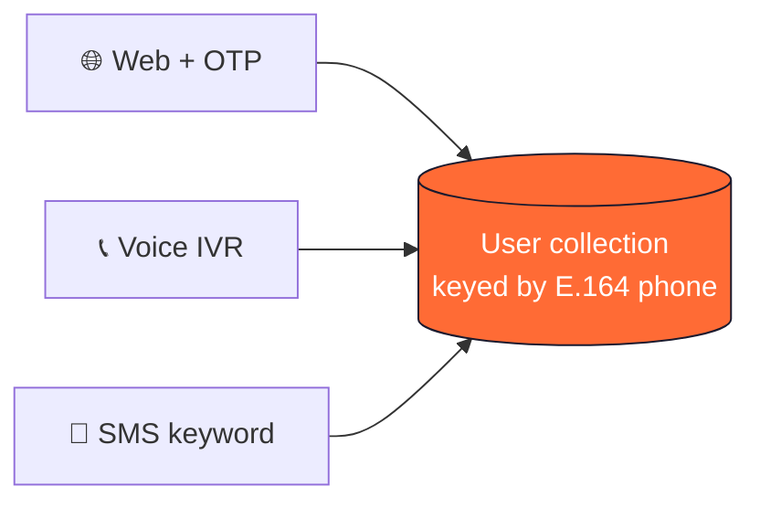
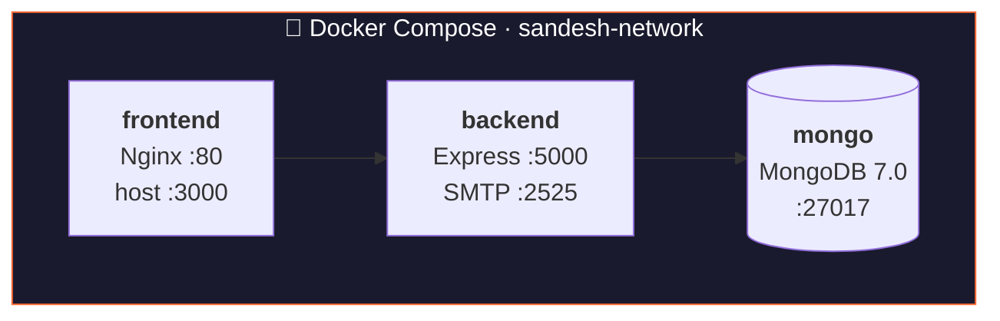
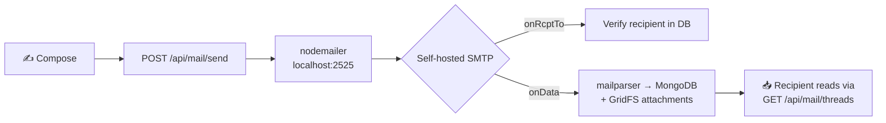
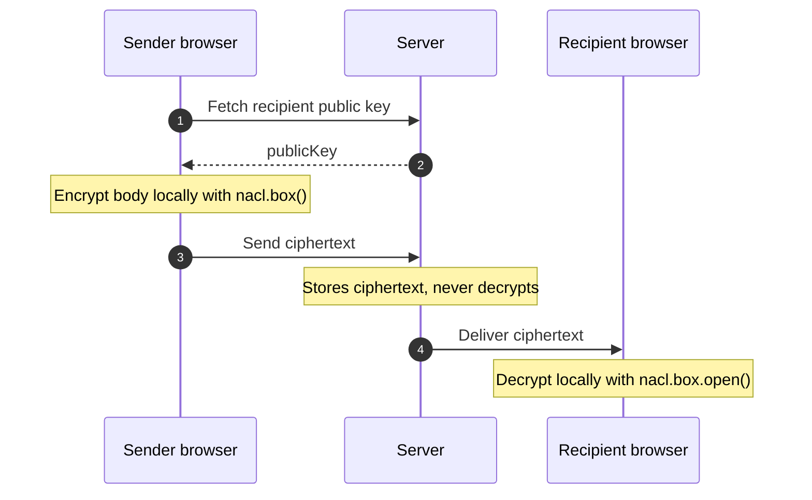

<div align="center">


<br/>

**A privacy-first, self-hosted webmail platform where `9876543210@sandesh.in` is a real, working inbox.**

<br/>


<br/>

[**Quick Start**](#-quick-start) · [**Features**](#-features) · [**Architecture**](#-architecture) · [**Tech Stack**](#-tech-stack) · [**API**](#-api-reference) · [**Environment**](#-environment-variables) · [**Structure**](#-project-structure)

</div>

<br/>

## 🎯 What is Sandesh?

**Sandesh** (संदेश, Hindi for "message") turns a phone number into a full email address. No traditional signup. `+919876543210` simply becomes `9876543210@sandesh.in`.

| | |
|---|---|
| 📮 **Own SMTP server** | No SendGrid, Mailgun or AWS SES. Mail is received and stored by our own daemon. |
| 🔐 **End-to-end encrypted** | Messages are encrypted in the browser. The server never sees plaintext. |
| 📱 **Three ways to sign up** | Web + OTP, Voice IVR call, or an SMS keyword. |
| 🤖 **AI built in** | Email drafting, spam detection and an FAQ chatbot. |

> [!NOTE]
> Built for the **Alphastack Buildathon**, a 7-day hackathon, by a team of 3.

<br/>

## 🚀 Quick Start

**You need:** [Docker Desktop](https://www.docker.com/products/docker-desktop/) (running) and Git.

```bash
# 1. Clone
git clone <repo-url>
cd sandesh

# 2. Copy the environment template
cp .env.example .env

# 3. Build and start everything
docker compose up --build
```

Then open:

| Service | URL |
|---|---|
| 🌐 Frontend | http://localhost:3000 |
| 🔌 API health | http://localhost:5000/api/health |

<details>
<summary><b>👤 Demo accounts (seeded automatically on first run)</b></summary>

<br/>

| Account | Phone | Password | Email |
|---|---|---|---|
| Alice Sharma | `+919876543210` | `password123` | `9876543210@sandesh.in` |
| Bob Verma | `+919876543211` | `password123` | `9876543211@sandesh.in` |

</details>

<br/>

## ✨ Features

### 📧 Core Email

- **Self-hosted SMTP server**: RFC 5321 compliant mail daemon on port `2525`, built with `smtp-server`, `mailparser` and `nodemailer`.
- **Gmail-style inbox**: three-pane layout with sidebar, thread list and message view. Compose, reply, forward.
- **Threaded conversations**: messages group into threads automatically, in chronological order.
- **Attachments up to 20 MB**: stored in MongoDB GridFS, with streaming download and inline preview.
- **Near real-time sync**: inbox refreshes every 3 seconds through React Query polling.

### 🔐 Security & Privacy

- **End-to-end encryption**: `tweetnacl` (Curve25519 key exchange + XSalsa20-Poly1305). The server only stores ciphertext.
- **Client-side keys**: keypairs are generated in the browser. Private keys never leave the device.
- **Safe passwords**: hashed with `bcrypt` (10 rounds) and never sent over SMS or voice.
- **Stateless sessions**: signed JWTs.

### 🤖 AI Features

- **AI email drafting**: write emails with help from Groq (Qwen 3.8-27B).
- **Spam detection**: LLM-based filtering, with an evaluation suite in `backend/spam-eval/`.
- **FAQ chatbot**: in-app support assistant.

### 🎨 User Experience

- Custom **Sandesh design language** using Tailwind CSS, Framer Motion and Lucide icons.
- Editable profile: display name, avatar, public key.
- Instant thread search and filtering.
- Foldable sidebar and a mobile-friendly layout.
- Ready-made email templates.

<br/>

### 📱 Three Signup Doors



| Door | Channel | How it works |
|---|---|---|
| 🌐 **Web + OTP** | Website | Enter phone → get OTP by SMS → set password → inbox ready |
| 📞 **Voice IVR** | Phone call | Call the Telnyx number → press `1` → skeleton account created → finish on web |
| 💬 **SMS keyword** | Text message | Text `SIGNUP` to the linked number → skeleton account created → finish on web |

<br/>

## 🏗 Architecture

### System overview



### Mail flow



### E2EE flow



<br/>

## 🛠 Tech Stack

<details open>
<summary><b>⚙️ Backend</b></summary>

<br/>

| Technology | Purpose |
|---|---|
| **Node.js 20 LTS** | Runtime |
| **Express 4** | REST API |
| **Mongoose 8** | MongoDB ODM |
| **smtp-server** | Self-hosted SMTP daemon (RFC 5321) |
| **mailparser** | MIME parsing (RFC 2822) |
| **nodemailer** | SMTP client for internal relay |
| **bcrypt** | Password hashing |
| **jsonwebtoken** | JWT sessions |
| **zod** | Request validation |
| **libphonenumber-js** | Phone normalization (E.164) |
| **multer** | File uploads |
| **Groq SDK** | AI drafting, spam, FAQ |
| **pino** | Structured JSON logging |
| **migrate-mongo** | Database migrations |
| **mongodb-memory-server** | Zero-config local dev fallback |

</details>

<details open>
<summary><b>🎨 Frontend</b></summary>

<br/>

| Technology | Purpose |
|---|---|
| **React 18** | UI framework |
| **TypeScript 5.5** | Type safety |
| **Vite 5** | Build tool and dev server |
| **Tailwind CSS 3** | Styling |
| **@tanstack/react-query** | Server state and polling |
| **react-router-dom 6** | Routing |
| **react-hook-form + zod** | Forms and validation |
| **Framer Motion** | Animations |
| **Lucide React** | Icons |
| **tweetnacl** | Client-side E2EE |

</details>

<details open>
<summary><b>☁️ Infrastructure</b></summary>

<br/>

| Technology | Purpose |
|---|---|
| **Docker + Compose** | Containerized deployment |
| **Nginx** | Static files and reverse proxy |
| **MongoDB 7.0** | Database and GridFS |
| **Telnyx** | SMS and Voice IVR |

</details>

<br/>

## 📡 API Reference

> [!TIP]
> Endpoints marked 🔒 need an `Authorization: Bearer <JWT>` header.

<details>
<summary><b>🔑 Authentication</b> · <code>/api/auth</code></summary>

<br/>

| Method | Endpoint | Body | Description |
|---|---|---|---|
| `POST` | `/api/auth/check` | `{ phone }` | Check if the phone exists and its password status |
| `POST` | `/api/auth/setup-token` | `{ phone }` | Generate a setup token for web registration |
| `POST` | `/api/auth/set-password` | `{ setupToken, password }` | Set password for a new or skeleton user, returns JWT |
| `POST` | `/api/auth/login` | `{ phone, password }` | Log in and receive a JWT |

</details>

<details>
<summary><b>👤 User profile</b> · <code>/api/me</code></summary>

<br/>

| Method | Endpoint | Auth | Description |
|---|---|---|---|
| `GET` | `/api/me` | 🔒 | Current user profile and email address |
| `PATCH` | `/api/me/profile` | 🔒 | Update display name, avatar or public key |

</details>

<details>
<summary><b>📬 Mail</b> · <code>/api/mail</code></summary>

<br/>

| Method | Endpoint | Auth | Description |
|---|---|---|---|
| `GET` | `/api/mail/threads` | 🔒 | List threads, newest first |
| `GET` | `/api/mail/threads/:id` | 🔒 | Get thread messages and reset unread count |
| `POST` | `/api/mail/send` | 🔒 | Send email via internal SMTP (`multipart/form-data`) |
| `GET` | `/api/mail/verify-recipient` | 🔒 | Check the recipient exists before sending |
| `GET` | `/api/mail/attachments/:id` | none | Stream an attachment from GridFS |

</details>

<details>
<summary><b>📞 Telephony webhooks</b></summary>

<br/>

| Method | Endpoint | Provider | Description |
|---|---|---|---|
| `POST` | `/voice/incoming` | Telnyx | IVR welcome prompt with `<Gather>` |
| `POST` | `/voice/menu` | Telnyx | Create skeleton account on keypress |
| `POST` | `/sms/incoming` | Telnyx | Handle the `SIGNUP` keyword and create the account |

</details>

<details>
<summary><b>💬 FAQ & health</b></summary>

<br/>

| Method | Endpoint | Auth | Description |
|---|---|---|---|
| `POST` | `/api/faq/ask` | 🔒 | Ask the AI chatbot a question |
| `GET` | `/api/health` | none | Service health check |

</details>

<br/>

## ⚙️ Environment Variables

```bash
cp .env.example .env
```

| Variable | Required | Default | Description |
|---|:---:|---|---|
| `JWT_SECRET` | ✅ | `change-me-in-production` | Secret for signing JWTs |
| `MONGODB_URI` | | `mongodb://mongo:27017/phonemail` | MongoDB connection string |
| `MAIL_DOMAIN` | | `sandesh.in` | Email domain for all accounts |
| `FRONTEND_PORT` | | `3000` | Host port for the web UI |
| `BACKEND_PORT` | | `5000` | Host port for the API |
| `SMTP_PORT` | | `2525` | Host port for SMTP |
| `GROQ_MODEL` | | `qwen/qwen3.8-27b` | Groq model identifier |
| `LOG_LEVEL` | | `info` | `fatal` · `error` · `warn` · `info` · `debug` · `trace` |
| `TELNYX_API_KEY` | optional | none | Telnyx API key for SMS/Voice |
| `TELNYX_PHONE_NUMBER` | optional | none | Your Telnyx number (E.164) |
| `TELNYX_CONNECTION_ID` | optional | none | Telnyx Call Control App ID |
| `TELNYX_MESSAGING_PROFILE_ID` | optional | none | Telnyx Messaging Profile ID |
| `PUBLIC_WEBHOOK_BASE_URL` | optional | none | Public URL for Telnyx callbacks |
| `GROQ_API_KEY` | optional | none | Groq API key for AI features |

> [!NOTE]
> Telnyx and Groq are **optional**. Without them, SMS/Voice is disabled and AI features fall back gracefully.

<br/>

## 📂 Project Structure

<details>
<summary><b>Click to expand the full tree</b></summary>

```
sandesh/
├── backend/
│   ├── Dockerfile                  # Node 20 slim + dumb-init
│   ├── migrate-mongo-config.js     # Migration config
│   ├── migrations/                 # Versioned schema migrations
│   ├── spam-eval/                  # Spam detection evaluation
│   │   ├── dataset.json
│   │   └── eval.js
│   ├── src/
│   │   ├── index.js                # Express + SMTP bootstrap
│   │   ├── models/                 # User, Thread, Message, EmailTemplate,
│   │   │                           # FaqItem, OtpVerification
│   │   ├── routes/                 # auth, mail, me, faq, webhook
│   │   ├── services/               # auth, mail, smtp, telnyx, groq,
│   │   │                           # groqEmail, spam, token
│   │   ├── middleware/             # Auth, error handlers
│   │   └── utils/                  # Phone normalization, helpers
│   └── uploads/                    # Avatar storage (Docker volume)
│
├── frontend/
│   ├── Dockerfile                  # Vite build → Nginx
│   ├── nginx.conf                  # /api → backend:5000
│   └── src/
│       ├── App.tsx                 # Router + AuthProvider
│       ├── main.tsx
│       ├── index.css
│       ├── pages/                  # Login, Dashboard, Profile,
│       │                           # Privacy, Terms
│       ├── components/
│       │   ├── mail/               # Sidebar, ThreadList, EmailView,
│       │   │                       # ComposeModal, AiDraftModal, SendBar,
│       │   │                       # ChatStream, E2eeVerificationModal ...
│       │   ├── auth/  landing/  layout/  faq/
│       │   └── showcase/  common/  ui/
│       ├── context/                # AuthContext
│       └── lib/                    # API client, React Query setup
│
├── scripts/dev.js                  # Runs backend + frontend together
├── docs/phonemail-prd.md           # Product Requirements Document
├── docker-compose.yml              # mongo, backend, frontend
├── .env.example
├── agents.md  design.md  docker.md  prd.md
└── package.json
```

</details>

<br/>

## 📊 Data Models

<details>
<summary><b>User</b></summary>

```javascript
{
  phone: "+919876543210",        // Unique, E.164, IS the email local-part
  passwordHash: "$2b$10$...",    // bcrypt hash (null for skeleton accounts)
  hasSetPassword: true,          // false until web setup is complete
  createdVia: "web",             // "web" | "ivr" | "sms"
  aliasIds: [],                  // Custom email aliases
  displayName: "Alice Sharma",
  profilePictureUrl: null,
  publicKey: "base64...",        // E2EE public key (tweetnacl)
  createdAt: "2026-09-28T..."
}
```

</details>

<details>
<summary><b>Thread</b></summary>

```javascript
{
  participants: [ObjectId, ObjectId],
  participantEmails: ["9876543210@sandesh.in", "9876543211@sandesh.in"],
  subject: "Project Update",
  lastMessage: { text: "...", from: ObjectId, createdAt: Date, hasAttachments: false },
  lastMessageAt: "2026-09-29T...",
  unreadCounts: { "<userId>": 2 }
}
```

</details>

<details>
<summary><b>Message</b></summary>

```javascript
{
  threadId: ObjectId,
  from: ObjectId,
  fromEmail: "9876543210@sandesh.in",
  to: [ObjectId],
  toEmails: ["9876543211@sandesh.in"],
  subject: "Project Update",
  text: "Hey, here's the latest...",   // Ciphertext when E2EE is active
  html: "<p>Hey, here's the latest...</p>",
  attachments: [{ filename: "report.pdf", gridFsId: ObjectId, contentType: "application/pdf", size: 204800 }],
  readBy: [ObjectId],
  createdAt: "2026-09-29T..."
}
```

</details>

<br/>

## 🔒 Security

| Area | Implementation |
|---|---|
| Password hashing | `bcrypt`, 10 salt rounds |
| Sessions | Signed JWTs with a configurable secret |
| Input validation | Every request body validated with Zod |
| E2EE | Client-side `tweetnacl` (Curve25519 + XSalsa20-Poly1305) |
| Private keys | Browser only (IndexedDB/localStorage), never sent to the server |
| Telephony | Passwords never travel over SMS or voice |
| SMTP scope | Closed loop only (`@sandesh.in` ↔ `@sandesh.in`), no internet federation |
| Upload limit | 30 MB at Nginx (`client_max_body_size`) |
| Shutdown | `dumb-init` forwards signals correctly as PID 1 |

> [!WARNING]
> Clearing browser storage or switching devices **permanently loses the E2EE private key**. This is the same trade-off Signal and WhatsApp make. There is no key recovery without breaking the end-to-end guarantee.

<br/>

## 🧩 Design Decisions

| Decision | Choice | Why |
|---|---|---|
| SMTP engine | Custom `smtp-server` + `nodemailer` | Hackathon rule: no third-party email SaaS |
| SMTP port | `2525`, not `25` | Port 25 is blocked by most clouds and ISPs |
| Attachments | MongoDB GridFS | Avoids the 16 MB BSON limit, supports chunked streaming |
| Reading mail | REST API, not IMAP/POP3 | IMAP adds huge complexity with no webmail benefit |
| Live updates | React Query polling (3s) | Stateless and resilient, simpler than WebSockets |
| SMS provider | Telnyx | One API for SMS and Voice, better free tier |
| AI backend | Groq (Qwen 3.8-27B) | Fast inference, generous free tier |
| Dev DB fallback | `mongodb-memory-server` | Zero-config local development |

<br/>

## 🐳 Docker Operations

<details>
<summary><b>Day-to-day commands</b></summary>

<br/>

| Action | Command |
|---|---|
| Start | `docker compose up` |
| Start with rebuild | `docker compose up --build` |
| Start in background | `docker compose up -d` |
| Stop | `docker compose down` |
| Stop and wipe database | `docker compose down -v` |
| List containers | `docker compose ps` |
| Backend logs | `docker compose logs -f backend` |
| All logs | `docker compose logs -f` |
| Shell into backend | `docker compose exec backend sh` |
| Rebuild one service | `docker compose up --build backend` |

</details>

<details>
<summary><b>When to rebuild</b></summary>

<br/>

| What changed | Action |
|---|---|
| Source code or npm packages | `docker compose up --build` |
| `.env` values only | `docker compose down && docker compose up` |
| `docker-compose.yml` | `docker compose down && docker compose up --build` |
| Need a clean slate | `docker compose down -v && docker system prune -f && docker compose up --build` |

</details>

<br/>

## 🧪 Local Development (without Docker)

```bash
# Terminal 1: MongoDB (or use Atlas)
mongod --dbPath ./backend/.mongo-data

# Terminal 2: backend (:5000, with --watch)
cd backend
cp .env.example .env
npm install
npm run dev

# Terminal 3: frontend (:5173)
cd frontend
npm install
npm run dev
```

Or run both at once from the repo root:

```bash
npm run dev
```

> [!TIP]
> **Fallback mode:** with no MongoDB available, the backend starts an embedded `mongodb-memory-server` (WiredTiger), saves data to `./backend/.mongo-data/`, and seeds the demo accounts.

<br/>

## 🔧 Troubleshooting

| Problem | Fix |
|---|---|
| `docker compose` not found | Use `docker-compose` (hyphenated) on older Docker |
| Port already in use | Change `FRONTEND_PORT`, `BACKEND_PORT` or `SMTP_PORT` in `.env` |
| Containers can't reach MongoDB | Use the hostname `mongo`, not `localhost`, inside Docker |
| SMTP `2525` unreachable from outside | Expected. SMTP is internal, closed-loop delivery only |
| `bcrypt` build fails | The backend uses `node:20-slim` (Debian). Don't switch to Alpine |
| AI features not working | Set `GROQ_API_KEY` in `.env` |
| SMS/Voice not working | Set the Telnyx credentials and `PUBLIC_WEBHOOK_BASE_URL` |

<br/>

## 👥 Team

| Role | Owns |
|---|---|
| **Engineer 1** | SMTP server, message/thread storage, GridFS attachments, spam detection |
| **Engineer 2** | Auth (OTP + password), schema design, Telnyx (SMS + Voice), AI integration |
| **Engineer 3** | React frontend: login, inbox, compose/reply, thread view, profile, settings |

<br/>

## 📄 Documentation

| Document | What's inside |
|---|---|
| [`prd.md`](prd.md) | Product Requirements Document |
| [`design.md`](design.md) | System architecture and design |
| [`docker.md`](docker.md) | Docker setup and operations |
| [`agents.md`](agents.md) | AI agent development guidelines |
| [`.env.example`](.env.example) | Environment variable template |

<br/>

<div align="center">

**संदेश** · Every phone number deserves an inbox.

<sub>Built with Node.js, React, MongoDB, and a lot of ☕ in 7 days.</sub>


</div>
