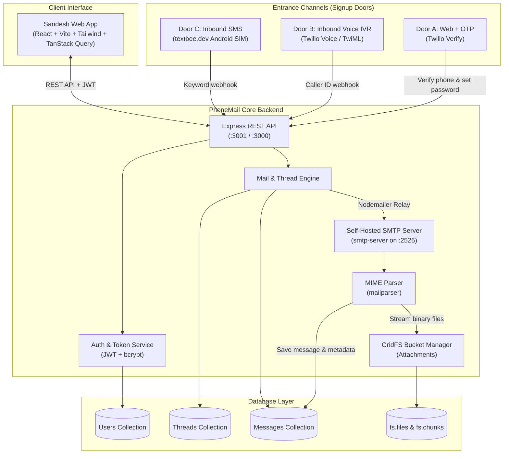
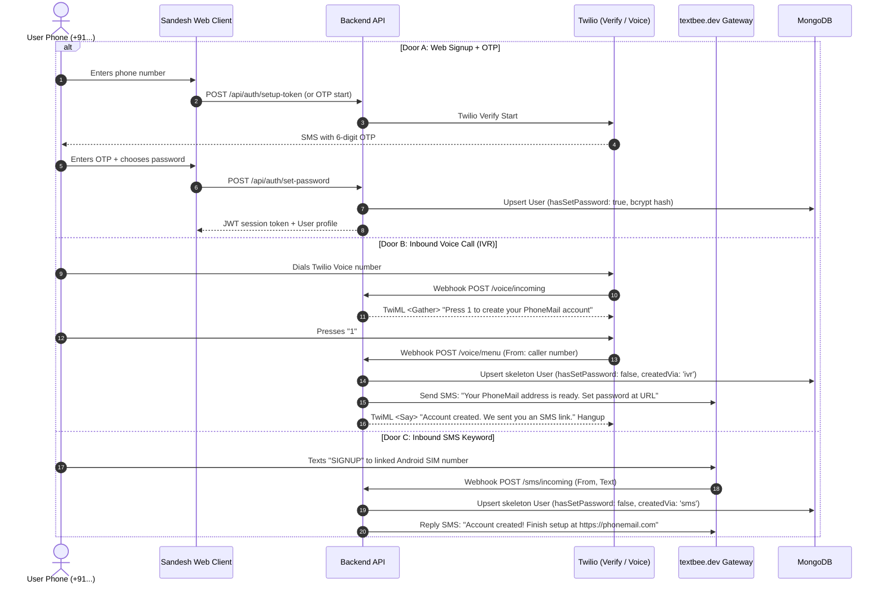
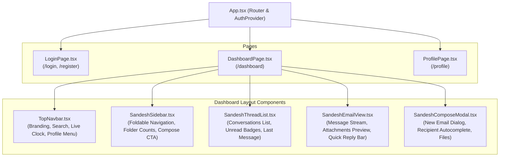
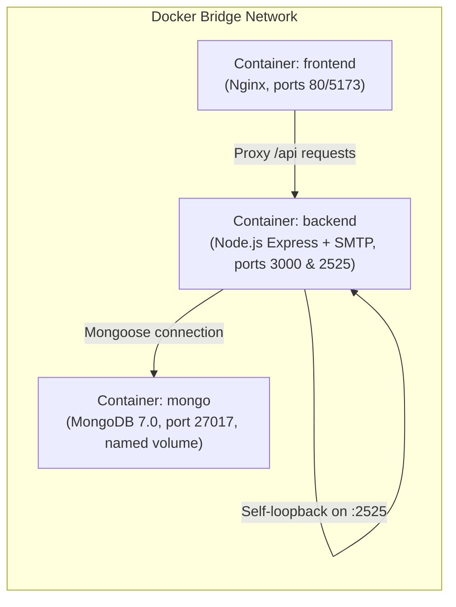

# PhoneMail (संदेश / Sandesh) — System Design Document

**Document Version:** 1.0.0  
**Status:** Living Architecture Document  
**Project:** Phone-number-as-email Webmail Platform with Self-Hosted SMTP  
**Repository:** `c:/phonemail`  

---

## 1. Executive Summary & Vision

**PhoneMail** (branded as **संदेश / Sandesh**) transforms a user's phone number into a fully functional, self-hosted email address (e.g. `+919876543210` $\rightarrow$ `9876543210@phonemail.com`).

Unlike conventional webmail that relies on third-party mail providers (SendGrid, Mailgun, AWS SES), PhoneMail features an **in-house, self-implemented SMTP server** combined with a hybrid webmail and conversational messaging UI. It supports multiple account creation channels (Web + OTP, Voice Call IVR, and SMS), password-authenticated access, GridFS attachment storage, and a client-side End-to-End Encryption (E2EE) architecture.



---

## 2. High-Level System Architecture

The application is structured as a decoupled client-server architecture with internal services communicating across dedicated protocols:

| Layer | Technology | Primary Role / Responsibility |
|---|---|---|
| **Frontend Web Client** | React 18, TypeScript, Vite, Tailwind CSS, Lucide Icons | Responsive 3-pane Sandesh dashboard, authentication modal, compose modal, attachment previews, thread polling. |
| **State & Data Fetching** | `@tanstack/react-query`, React Context (`AuthContext`) | Optimistic updates, background inbox synchronization (3s polling interval), session persistence in `localStorage`. |
| **REST API Server** | Node.js, Express, `cors`, `zod`, `pino` | Routes for authentication, user profiles, thread listing, message retrieval, attachment streaming, and recipient verification. |
| **SMTP Mail Server** | `smtp-server` (running on port 2525) | Self-hosted mail daemon listening for RFC 5321 commands (`HELO/EHLO`, `MAIL FROM`, `RCPT TO`, `DATA`), verifying recipient existence on the fly. |
| **MIME Stream Parser** | `mailparser` (`simpleParser`) | Parses RFC 822/2822 MIME streams, extracting headers, body content (plain text & HTML), sender/recipient metadata, and attachment buffers. |
| **Database & File Store** | MongoDB (v7+) / Mongoose, GridFS | Stores collections for Users, Threads, Messages, and chunks of binary files up to 20MB. |
| **Local Persistence Fallback** | `mongodb-memory-server` with `wiredTiger` engine | Fallback when remote MongoDB Atlas is unreachable, persisting data locally to `.mongo-data/` with automatic test user seeding. |

---

## 3. Identity, Authentication & Entrance Doors

PhoneMail treats the user's **E.164 phone number** as the primary unique key across all systems.

### 3.1 The Three Parallel Doors

Users may sign up via one of three entry points. All converge on the same MongoDB `User` document:



### 3.2 Skeleton Account & Password Security Rule
- **Zero Sensitive Data over Telephony:** Passwords are never accepted or transmitted over SMS or phone calls.
- Inbound IVR (Door B) and Inbound SMS (Door C) create a skeleton record:
  ```json
  {
    "phone": "+919876543210",
    "passwordHash": null,
    "hasSetPassword": false,
    "createdVia": "ivr"
  }
  ```
- When the user subsequently visits the web client, the system checks `hasSetPassword`. If `false`, it prompts them to complete setup via an OTP/password creation workflow.
- Returning users authenticate with `POST /api/auth/login` using their phone number and password, receiving a signed JWT.

---

## 4. Self-Implemented SMTP Engine & Mail Flow

PhoneMail strictly avoids third-party transactional mail SaaS (SendGrid, Mailgun, Amazon SES). Email routing operates via a closed-loop internal SMTP daemon.

### 4.1 Internal SMTP Architecture (Port 2525)

```mermaid
flowchart TD
    subgraph "Send Flow (Outbound)"
        UI["Web UI: Compose / Quick Send"] -->|POST /api/mail/send (multipart/form-data)| Route["mail.routes.js"]
        Route -->|sendMailViaSmtp()| MailSvc["mail.service.js"]
        MailSvc -->|nodemailer transporter (127.0.0.1:2525)| SMTPEngine["Local SMTPServer (:2525)"]
    end

    subgraph "Receive & Storage Flow (Inbound)"
        SMTPEngine -->|onRcptTo hook| CheckUser{"Verify recipient exists in User DB?"}
        CheckUser -- No --> Reject550["550 5.1.1 Recipient does not exist"]
        CheckUser -- Yes --> Accept["Cache recipient & Accept"]
        Accept -->|onData stream hook| Stream["simpleParser(stream)"]
        Stream --> MIME["mailparser"]
        MIME --> Extr["Extract headers, text, HTML & attachments"]
        Extr --> UploadGF["uploadToGridFS() for each attachment"]
        UploadGF --> UpsertThread["Find or create Thread(participants: [from, to])"]
        UpsertThread --> CreateMsg["Create Message document in MongoDB"]
        CreateMsg --> IncUnread["Increment unreadCounts for recipient"]
    end

    subgraph "Read Flow"
        UserB["Recipient Web Client"] -->|GET /api/mail/threads & /threads/:id| RESTRead["mail.routes.js"]
        RESTRead --> QueryDB[("MongoDB Message/Thread Query")]
        UserB -->|GET /api/mail/attachments/:id| StreamAtt["Stream from GridFS (Inline/Download)"]
    end
```

### 4.2 Why Port 2525?
- Port 25 is traditionally blocked by cloud providers (AWS, GCP, DigitalOcean, Hetzner) and residential ISPs to curb spam.
- Because PhoneMail operates in a closed loop (`@phonemail.com` $\leftrightarrow$ `@phonemail.com`), running on port **2525** guarantees zero external blocking and complete independence from cloud firewall policies.

### 4.3 SMTP Hooks Implementation Details
1. **`onRcptTo(address, session, cb)`**:
   - Parses the recipient email to an E.164 phone number via `parseRecipientPhone()`.
   - Queries `User.findOne({ phone })`. If absent, rejects with an RFC 550 SMTP code (`550 5.1.1 Recipient does not exist on PhoneMail`).
   - Caches validated user documents onto `session.resolvedRecipients`.
2. **`onData(stream, session, cb)`**:
   - Pipes stream into `simpleParser()`.
   - Resolves sender against `User` collection.
   - Saves attachments directly to MongoDB GridFS.
   - Finds or creates a conversational `Thread` between sender and recipients.
   - Persists a new `Message` record and updates thread `lastMessage`, `lastMessageAt`, and `unreadCounts`.

---

## 5. Data Models & Database Schemas

### 5.1 `User` Schema
```typescript
interface IUser {
  phone: string;              // Unique index, normalized E.164 (e.g. '+919876543210')
  passwordHash: string | null;// bcrypt hash (salt rounds: 10)
  hasSetPassword: boolean;    // false for skeleton IVR/SMS users until web setup
  createdVia: 'web' | 'ivr' | 'sms';
  aliasIds: string[];         // Reserved for custom aliases
  displayName: string;        // Human-friendly name (e.g. "Alice Sharma")
  profilePictureUrl: string | null;
  publicKey: string | null;   // For client-side E2EE (tweetnacl box public key)
  createdAt: Date;
}
```

### 5.2 `Thread` Schema
```typescript
interface IThread {
  participants: ObjectId[];    // References to User documents (indexed)
  participantEmails: string[]; // E.g. ['9876543210@phonemail.com', '9876543211@phonemail.com']
  subject: string;             // Thread topic / subject header
  lastMessage: {
    text: string;
    from: ObjectId;
    createdAt: Date;
    hasAttachments: boolean;
  };
  lastMessageAt: Date;         // Indexed descending for inbox sorting
  unreadCounts: Map<string, number>; // Keyed by userId string -> count
  createdAt: Date;
  updatedAt: Date;
}
```

### 5.3 `Message` Schema
```typescript
interface IAttachment {
  filename: string;
  gridFsId: ObjectId;         // ID in fs.files
  contentType: string;        // E.g. 'image/png', 'application/pdf'
  size: number;               // Bytes
}

interface IMessage {
  threadId: ObjectId;         // Reference to Thread (indexed)
  from: ObjectId;             // Reference to User (sender)
  fromEmail: string;          // E.g. '9876543210@phonemail.com'
  to: ObjectId[];             // Recipients (references to User)
  toEmails: string[];         // Recipient email addresses
  subject: string;
  text: string;               // Plain text body (or ciphertext when E2EE active)
  html?: string;              // Rendered HTML if parsed from MIME
  attachments: IAttachment[]; // GridFS file references
  readBy: ObjectId[];         // User IDs who have viewed this message
  createdAt: Date;
}
```

### 5.4 GridFS File Storage
- Attachments are stored across two internal collections:
  - `fs.files`: Metadata, filename, contentType, uploadDate, chunk size (255 KB default).
  - `fs.chunks`: Binary chunks indexed by `(files_id, n)`.
- Streaming endpoint: `GET /api/mail/attachments/:id` streams directly from the GridFS bucket to the client response with appropriate `Content-Type` and `Content-Disposition`.

---

## 6. Frontend Architecture & Design System

The frontend is built with React, Vite, TypeScript, and Tailwind CSS under the **Sandesh** design language.



### 6.1 Key Frontend Features
1. **Three-Pane Sandesh Layout:**
   - **Pane 1 (Left):** Foldable navigation sidebar with unread counters, folders (Inbox, Sent, Starred, Drafts, Trash), and user address pill (`9876543210@phonemail.com`).
   - **Pane 2 (Center):** Thread list with real-time search filtering, timestamps, unread indicators, and sender avatar generation.
   - **Pane 3 (Right):** Thread view rendering message history chronologically, attachment cards with inline viewing/downloading, and an interactive reply input with file attachment capabilities.
2. **Phone Number & Local-Part Display Utilities:**
   - Indian standard: `+919876543210` displays as `9876543210@phonemail.com`.
   - Normalization handled centrally via `utils/phone.js` and `lib/mailApi.ts`.
3. **Live Syncing & React Query Polling:**
   - Inboxes and active threads automatically poll every 3 seconds (`refetchInterval: 3000`), ensuring immediate synchronization when new messages are received via SMTP without requiring complex WebSocket connections initially.

---

## 7. End-to-End Encryption (E2EE) Architecture

### 7.1 Cryptographic Model
- **Library:** `tweetnacl` / `tweetnacl-util`.
- **Primitives:**
  - Asymmetric key agreement: Curve25519 (`nacl.box.keyPair()`).
  - Authenticated encryption: XSalsa20-Poly1305.
- **Key Generation & Storage:**
  - When a user initializes their account on the browser, a keypair is generated client-side:
    - `publicKey`: Uploaded to the backend and stored in `User.publicKey`.
    - `secretKey`: Stored exclusively in browser client storage (`IndexedDB` or `localStorage`). **Never transmitted to the server.**
- **Message Encryption & Decryption Flow:**
  1. Sender fetches recipient's `publicKey` via `GET /api/mail/verify-recipient?query=...`.
  2. Sender generates an ephemeral nonce and encrypts the message body client-side using `nacl.box(messageBuffer, nonce, recipientPublicKey, senderSecretKey)`.
  3. The resulting ciphertext + nonce is sent over SMTP/REST.
  4. The server and SMTP server only handle encrypted strings.
  5. The recipient's browser fetches ciphertext and decrypts using `nacl.box.open(cipherBuffer, nonce, senderPublicKey, recipientSecretKey)`.

---

## 8. REST API Specification

### 8.1 Authentication Endpoints (`/api/auth`)

| Method | Endpoint | Request Body | Description |
|---|---|---|---|
| `POST` | `/api/auth/check` | `{ phone: string }` | Checks if a phone number exists and whether password is set. |
| `POST` | `/api/auth/setup-token`| `{ phone: string }` | Generates a setup token for web registration or IVR/SMS conversion. |
| `POST` | `/api/auth/set-password`| `{ setupToken: string, password: string }` | Sets password for skeleton or new user; returns JWT session token. |
| `POST` | `/api/auth/login` | `{ phone: string, password: string }` | Authenticates existing user; returns JWT session token. |

### 8.2 User Endpoints (`/api/me`)

| Method | Endpoint | Headers | Description |
|---|---|---|---|
| `GET` | `/api/me` | `Authorization: Bearer <jwt>` | Returns currently logged-in user profile, email, and aliases. |
| `PATCH`| `/api/me/profile` | `Authorization: Bearer <jwt>` | Updates `displayName`, `profilePictureUrl`, or `publicKey`. |

### 8.3 Mail Endpoints (`/api/mail`)

| Method | Endpoint | Headers / Form Data | Description |
|---|---|---|---|
| `GET` | `/api/mail/threads` | `Authorization: Bearer <jwt>` | Returns all conversation threads for user, ordered by `lastMessageAt DESC`. |
| `GET` | `/api/mail/threads/:id` | `Authorization: Bearer <jwt>` | Returns thread metadata and message list; resets thread unread count. |
| `POST`| `/api/mail/send` | `multipart/form-data`: `to`, `subject`, `text`, `attachments[]` | Relays email through internal port 2525 SMTP daemon. |
| `GET` | `/api/mail/verify-recipient` | `?query=phone_or_email` | Verifies recipient registration before dispatching mail. |
| `GET` | `/api/mail/attachments/:id` | None (Public / Tokenless Stream) | Streams attachment directly from MongoDB GridFS with MIME headers. |

### 8.4 Telephony Webhook Endpoints

| Method | Endpoint | Provider | Description |
|---|---|---|---|
| `POST` | `/voice/incoming` | Twilio Voice | Plays IVR welcome prompt and renders `<Gather numDigits="1" action="/voice/menu">`. |
| `POST` | `/voice/menu` | Twilio Voice | Creates skeleton user, triggers textbee setup SMS, and speaks confirmation. |
| `POST` | `/sms/incoming` | textbee.dev | Parses inbound `SIGNUP` keyword, creates skeleton user, sends SMS link. |

---

## 9. Infrastructure & Deployment Architecture

### 9.1 Containerization with Docker Compose

The entire stack is designed for single-command startup: `docker compose up -d`.



### 9.2 Zero-Setup Local Development Mode
- If MongoDB Atlas (`MONGODB_URI`) is offline or times out (3.5s timeout threshold), the backend automatically initializes an embedded **`mongodb-memory-server`** backed by WiredTiger in `./.mongo-data/`.
- Pre-seeds two demo accounts:
  - User 1: `+919876543210` (`password123`) $\rightarrow$ `9876543210@phonemail.com`
  - User 2: `+919876543211` (`password123`) $\rightarrow$ `9876543211@phonemail.com`
- Allows instant out-of-the-box local testing without network credentials.

---

## 10. Design Decisions & Trade-Offs Matrix

| Decision | Alternative Considered | Chosen Approach | Rationale / Trade-Off |
|---|---|---|---|
| **SMTP Delivery Engine** | SendGrid / AWS SES API | Custom `smtp-server` + `nodemailer` on port 2525 | Meets the core hackathon requirement of "No Third-Party Email SaaS". Complete ownership of the mail pipeline. |
| **Port Selection** | Port 25 | Port 2525 | Port 25 is blocked by default by almost all hosting providers and ISPs. Port 2525 avoids blocking in closed-loop systems. |
| **Attachment Storage** | Disk files or Base64 in JSON | MongoDB GridFS | Base64 bloating degrades BSON size limits (16MB). GridFS supports chunked streaming up to hundreds of megabytes. |
| **SMS & Voice Gateway Split**| Twilio for both SMS and Voice | Twilio for Voice (IVR); textbee.dev (Android SIM) for SMS | Twilio free trial restricts SMS bodies to templates. textbee uses a physical Android SIM with unrestricted SMS messaging. |
| **Read Protocol** | IMAP / POP3 daemon | Direct REST API queries | Implementing an IMAP server adds huge complexity with zero user benefit for a webmail client. Reading mail via REST is fast and reliable. |
| **Data Synchronization** | WebSockets (Socket.io) | Polling via React Query (3s interval) | Polling is resilient, stateless, reconnects automatically, and satisfies 7-day build time constraints before adding socket complexity. |

---

## 11. Extension Points & Roadmap

1. **Full End-to-End Encryption (E2EE) Integration:** Complete client-side key exchange and encrypt message bodies before reaching the SMTP stream.
2. **WebSocket / Server-Sent Events (SSE):** Replace 3-second polling with real-time push updates for instant chat-like experience.
3. **Multi-Recipient & Group Mailing:** Support CC/BCC headers and thread fan-out to multiple `@phonemail.com` participants.
4. **Custom Aliases:** Allow users to register nicknames (e.g. `alex@phonemail.com`) linked to their primary phone number identifier.
5. **Spam & Rate Limiting:** Implement token-bucket rate limiters on `/api/mail/send` and IP reputation filters on the SMTP port.
