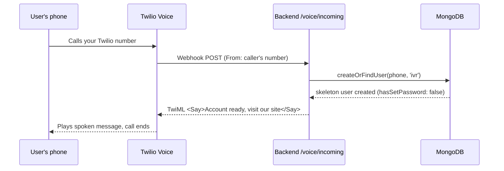
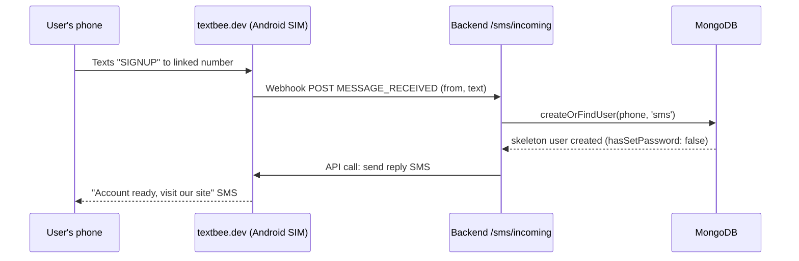
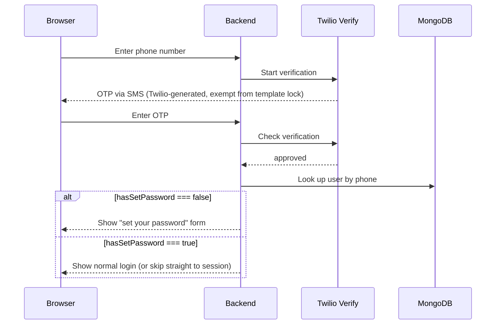
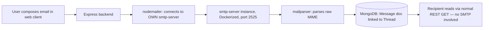

# PhoneMail — Product Requirements Document

**Project:** Phone-number-as-email webmail client
**Event:** Alphastack Buildathon (7-day hackathon)
**Team size:** 3
**Stack:** MERN (MongoDB, Express, React, Node.js) — web client only

---

## 1. One-line summary

PhoneMail gives every user an email address derived from their phone number
(`9876543210@phonemail.com`) and lets them get in three ways — website OTP,
inbound phone call, or inbound SMS — then use a Gmail-style web inbox backed
by a **self-implemented SMTP server** (no third-party mail SaaS).

## 2. Goals / non-goals

**In scope (v1)**
- Web client only (no mobile app, no WhatsApp-style chat UI)
- Three account-creation doors: Web+OTP, IVR call, SMS keyword
- Password-based login (OTP is a bonus, not the primary login path)
- Self-hosted SMTP server for send + receive, closed-loop (`@phonemail.com` ↔ `@phonemail.com` only)
- Gmail-style inbox: threads, compose, reply, attachments
- Client-side E2E encryption of message bodies (tweetnacl)
- Fully dockerized, zero-manual-setup judging (`docker compose up -d`)

**Explicitly out of scope**
- Mobile client
- Federation with real external mail providers (Gmail/Outlook)
- Server ever seeing plaintext of message bodies

## 3. Build order (what we solve, in order)

1. **Entrance layer** — all three signup doors create a valid `User` row
2. **Login** — password auth against those users, JWT session
3. **SMTP layer** — actual mail send/receive between two `@phonemail.com` accounts
4. Inbox UI, threads, attachments, E2E encryption, polish

This doc follows that order.

---

## 4. Phase 1 — Entrance (account creation)

### 4.1 The three doors are parallel, not sequential

A user picks **exactly one** door. All three converge on the same `User`
collection, keyed by normalized phone number (E.164, via `libphonenumber-js`).

| Door | Entry point | Identity proof | Provider |
|---|---|---|---|
| A. Web | Website form | OTP to their phone | Twilio Verify |
| B. Call | Dial your Twilio number | The number they called *from* | Twilio Voice (TwiML) |
| C. Text | Text `SIGNUP` to your textbee number | The number they texted *from* | textbee.dev |

### 4.2 Critical rule: passwords never travel over SMS/voice

Doors B and C only ever create a **skeleton account**:
`{ phone, passwordHash: null, hasSetPassword: false, createdVia: 'ivr'|'sms' }`.

They then tell the user (spoken `<Say>` for calls, generic SMS for texts) to
go to the website. On the website, the *same* OTP flow as Door A runs. Your
`createOrFindUser()` function checks `hasSetPassword`:
- `false` → treat as "finish setup, set a password"
- `true` → treat as normal login

One code path serves both "brand new signup" and "first login after IVR/SMS
signup." Nothing sensitive ever rides an SMS or a phone call.

### 4.3 Why two providers, and why this doesn't create conflicts

This is the part you asked about directly, so here's the full reasoning.

**The constraint that forces the split:** Twilio's free trial locks the SMS
`body` parameter to a small set of fixed templates — you cannot send custom
text or a link over Twilio SMS on trial. Twilio Voice has no such
restriction; `<Say>` is fully free-form even on trial. So:

- **Twilio owns everything that is NOT free-text SMS**: OTP codes (Twilio
  Verify writes that text itself, so it's exempt from the template
  restriction) and inbound voice calls (IVR).
- **textbee.dev owns 100% of SMS**, both directions: the inbound `SIGNUP`
  keyword *and* outbound "you've got mail" notifications. It runs through a
  real Android phone's SIM via their app, so there's no template
  restriction at all.

**Why there's no conflict between them:**

1. **Different phone numbers, different channels.** Your Twilio number is
   the one people *call*. Your textbee number (the SIM in the linked
   Android phone) is the one people *text*. These are two distinct numbers
   in this build — that's a direct consequence of the trial constraint, and
   it's worth being upfront about in the README/demo: "call this number to
   sign up by voice, text this other number to sign up by SMS."
2. **Different webhook routes on the same backend.** Twilio's voice webhook
   hits `/voice/incoming`; textbee's webhook hits `/sms/incoming`. Same
   Express app, same ngrok tunnel during dev, but the routes never overlap
   and neither provider knows the other exists.
3. **Shared identity model, not shared transport.** Both routes call the
   same `createOrFindUser(phone, createdVia)` function and write to the
   same `User` collection. The *only* thing that's shared is the data
   model — the transports (Twilio Voice vs. textbee SMS) are fully
   independent and can be built/tested in isolation.
4. **No provider ever calls the other.** Twilio never triggers an SMS in
   this design (it can't, on trial). textbee never triggers a call (it's an
   SMS gateway, not telephony). There is no handoff between them at
   runtime — each handles its one door end-to-end.

**Sequence — Door B (inbound call):**



**Sequence — Door C (inbound SMS):**



**Sequence — finishing setup on web (Door A, or B/C follow-up):**



Note: Twilio Verify's own OTP delivery uses SMS too, but that's a separate,
exempt code path inside Twilio (not textbee, not custom body) — so it
doesn't compete with textbee's SIGNUP-keyword SMS either.

### 4.3.1 IVR implementation detail: two webhooks, not one

A single call to your Twilio number generates **two separate webhook POSTs**
— account creation must live in the second one, not the first.

1. **Call connects** → `POST /voice/incoming` → play greeting, `<Gather>` a
   keypress, point its `action` at `/voice/menu`. Call stays live.
2. **Caller presses 1** → `POST /voice/menu` → this is where the account
   gets created and the SMS gets sent, *before* the confirmation `<Say>`
   plays — so "we just texted you" is true when the caller hears it.

```js
// POST /voice/menu
app.post('/voice/menu', async (req, res) => {
  const { Digits, From } = req.body;     // From = caller's E.164 number
  const twiml = new twilio.twiml.VoiceResponse();

  if (Digits === '1') {
    let user = await User.findOne({ phone: From });
    if (!user) {
      user = await User.create({ phone: From, passwordHash: null, hasSetPassword: false, createdVia: 'ivr', aliasIds: [] });
      await sendTextbeeSMS(From, `Your PhoneMail address is ready: ${toLocalPart(From)}@phonemail.com. Visit https://phonemail.com/setup to set your password.`);
      twiml.say('Your PhoneMail account has been created. We just texted you a link to set your password.');
    } else {
      await sendTextbeeSMS(From, `Reminder: your PhoneMail address is ${toLocalPart(From)}@phonemail.com. Visit https://phonemail.com/setup.`);
      twiml.say('You already have a PhoneMail account. We texted you a reminder.');
    }
  } else {
    twiml.say('Sorry, that is not a valid option.');
  }
  twiml.hangup();
  res.type('text/xml').send(twiml.toString());
});
```

**Normalization rule (decide once, use everywhere):** store `phone` as full
E.164 internally (`+919876543210`) — matches what Twilio/textbee both give
you, keeps uniqueness clean. Only strip `+91` when generating the
display/local-part of the email address, via one shared `toLocalPart()`
util — don't re-implement the slicing in multiple routes. Fine to hardcode
`+91`-stripping for a single-country hackathon; would need generalizing for
multi-country.

**Reliability note:** Twilio times out webhook responses around 15s. Put a
short timeout (~4s) on the textbee call and wrap it in try/catch — if
textbee is briefly slow, don't let it kill a call that already succeeded in
creating the DB row.

### 4.4 Provider setup checklist

**Twilio**
1. Sign up at twilio.com/try-twilio (free, no card)
2. Verify your own number (becomes a Verified Caller ID)
3. Console → copy Account SID + Auth Token → `.env`
4. **Buy a number for the Voice/IVR leg.** Twilio does not sell India
   local/mobile numbers at all (confirmed standing catalog gap, not a
   temporary restriction) — India toll-free (`+91800`) is the only India
   number type it offers, and that can be blocked on trial accounts until
   a Verified Caller ID exists (step 5, do it first if toll-free purchase
   fails). If toll-free stays blocked, buy a **US or UK local number**
   instead — fully available on trial credit, no regulatory bundle. The
   real cost: Indian callers dialing a US/UK number are making an
   international call (ISD rates apply to them) — acceptable for a
   hackathon demo with a known set of callers, not for production.
5. Add every tester's number under Verified Caller IDs (Day 1, regardless
   — and *before* attempting a toll-free purchase, since that's the most
   common cause of it failing on trial)
6. Console → Verify → Services → Create Service → copy Service SID
7. Number → Voice Configuration → "A call comes in" → Webhook →
   `<ngrok-url>/voice/incoming` → HTTP POST
8. Fast manual test: Console → TwiML Bins → paste
   `<Response><Say>test</Say></Response>` → point number at it temporarily

**textbee.dev**
1. Register at textbee.dev
2. Install their Android app on a spare phone that stays online all week +
   during the demo
3. Grant SMS permissions, toggle "Receive SMS" on
4. Dashboard → Register Device → scan QR → note Device ID
5. Dashboard → generate API key → `.env` as `TEXTBEE_API_KEY` /
   `TEXTBEE_DEVICE_ID`
6. Dashboard → Webhooks → point at `<ngrok-url>/sms/incoming`, subscribe to
   `MESSAGE_RECEIVED`
7. Test: text `SIGNUP` from any phone, confirm webhook fires + reply arrives

**ngrok (dev only)**
`ngrok http 3000` tunnels a public URL to localhost. Paste into both
providers' webhook fields. Free-tier URL changes on restart — keep one
session running, re-paste if it changes. Not needed once deployed.

---

## 5. Phase 2 — Login

- Password-based auth is the **default, spec-compliant path**. OTP is a
  "good to have," not required — don't gold-plate it before the rest works.
- Flow: phone number in → OTP via Twilio Verify → on success, either
  "set password" (first time) or "enter password" (returning) → JWT issued.
- `bcrypt` for hashing, `jsonwebtoken` for sessions, `zod` for request
  validation.
- No distinction in the login UI between someone who signed up via web,
  call, or text — by the time they reach login, it's one unified flow.

---

## 6. Phase 3 — Self-implemented SMTP (core deliverable)

This is the piece the organizers scrutinize most, since "no SaaS" applies
specifically to the email/SMTP layer.



**Libraries:** `smtp-server` (real SMTP server: `MAIL FROM`/`RCPT TO`/`DATA`),
`mailparser` (MIME → object), `nodemailer` (your backend's own SMTP client).

**Key decision:** run on port **2525**, not 25. Port 25 is blocked outbound
by most cloud providers by default and is unnecessary — this is a closed
loop (`phonemail.com`-to-`phonemail.com` only), no internet mail federation.

**Minimal shape:**
```js
// receiver
const server = new SMTPServer({
  authOptional: true,
  onRcptTo(address, session, cb) { /* validate recipient exists in DB */ cb(); },
  onData(stream, session, cb) {
    simpleParser(stream, (err, parsed) => { /* save to Mongo */ cb(); });
  }
});
server.listen(2525);

// sender, from your own backend, to your own server
const transporter = nodemailer.createTransport({ host: 'localhost', port: 2525, secure: false });
await transporter.sendMail({ from, to, subject, text });
```

Reading mail is **just a REST/DB read** — SMTP is only involved on the
sending side, since delivery within your own closed loop is a local
`onData` write.

---

## 7. End-to-end encryption

- `tweetnacl` for asymmetric crypto.
- Keypair generated **client-side** in the browser on signup.
- Only the **public key** goes to the backend, stored on `User`.
- Private key never leaves the browser (IndexedDB/localStorage).
- Compose: encrypt body client-side with recipient's public key before it
  ever hits the server.
- Server/SMTP layer only ever touches ciphertext.
- Scope: **message bodies only**, not subject lines/metadata — state this
  explicitly.
- Accepted trade-off (document in README, don't hide it): clearing browser
  storage or switching devices loses the private key permanently — same
  trade-off Signal/WhatsApp make. No recovery path without breaking the
  E2E guarantee.

---

## 8. Data model (MongoDB)

```js
// User
{
  phone: String,              // unique, E.164 — IS the email local-part
  passwordHash: String | null,
  hasSetPassword: Boolean,
  createdVia: 'web' | 'ivr' | 'sms',
  aliasIds: [String],         // spec requires alias management in settings
  displayName: String,
  profilePictureUrl: String | null,
  publicKey: String | null,   // for E2E
  createdAt: Date
}

// Thread
{
  participants: [ObjectId -> User],
  isGroup: Boolean,
  lastMessageAt: Date,
  createdAt: Date
}

// Message
{
  threadId: ObjectId -> Thread,
  from: ObjectId -> User,
  to: [ObjectId -> User],
  subject: String,
  body: String,                // ciphertext if E2E active
  attachments: [{ filename, gridFsId, mimeType, size }],
  repliedTo: ObjectId -> Message | null,  // each message repliable once — enforce in route logic
  read: Boolean,
  createdAt: Date
}
// + auto-managed GridFS: attachments.files, attachments.chunks
```

Attachments live in **GridFS**, not base64-in-document.

**Dev vs. judging DB:** shared MongoDB Atlas M0 during development (all 3
teammates point at one connection string); switch `MONGODB_URI` to the local
Dockerized `mongo` service before final submission — one env var change, no
code change, so `docker compose up -d` has zero external dependency.

---

## 9. Web client notes

- Gmail-style on web — the WhatsApp-style chat UI is a mobile-only
  requirement and out of scope here.
- Login card: `autocomplete="tel"` phone input; OTP input uses the WebOTP
  API (`navigator.credentials.get({otp:{transport:['sms']}})`) so Chrome
  auto-fills the code. (True phone-number auto-detection isn't a real API
  for privacy reasons — OTP auto-fill is the closest real equivalent.)
- Password field only appears after OTP verification succeeds.
- Perceived speed: skeleton screens over spinners, optimistic send UI,
  `react-query` with sensible `staleTime`, prefetch inbox the moment OTP
  verifies, gzip via nginx in prod.

---

## 10. Full stack

**Backend:** Express, mongoose, multer, bcrypt, jsonwebtoken,
libphonenumber-js, zod, twilio SDK, axios (textbee has no SDK),
smtp-server + mailparser + nodemailer, dotenv, cors, pino/morgan,
socket.io (optional, live inbox updates).

**Frontend:** React + Vite + TypeScript, Tailwind + shadcn/ui,
react-router-dom, @tanstack/react-query, react-hook-form + zod resolvers,
lucide-react, tweetnacl.

**Infra:** Docker + Docker Compose, nginx (serves built React app).

---

## 11. Docker Compose

Three services, one bridge network:

- `mongo` — `mongo:7`, named volume, `mongosh` healthcheck
- `backend` — builds `./backend`, runs `node src/index.js`, exposes
  **3000** (REST) and **2525** (SMTP)
- `frontend` — multi-stage: Vite build → nginx, exposes **5173→80**

`.env`: `MONGODB_URI`, `JWT_SECRET`, `MAIL_DOMAIN`, `TWILIO_ACCOUNT_SID`,
`TWILIO_AUTH_TOKEN`, `TWILIO_PHONE_NUMBER`, `TWILIO_VERIFY_SERVICE_SID`,
`TEXTBEE_API_KEY`, `TEXTBEE_DEVICE_ID`.

**Before final submission:** `MONGODB_URI` → `mongodb://mongo:27017/phonemail`
(local, not Atlas).

---

## 12. Team split & 7-day plan

| Person | Owns |
|---|---|
| 1 | SMTP server (smtp-server/mailparser/nodemailer), message/thread storage, GridFS attachments |
| 2 | Auth (web OTP + password), schema ownership, Twilio (Verify + Voice), textbee.dev integration |
| 3 | React frontend — signup/login, inbox, compose/reply, thread view, settings/aliases |

**Workflow:** branch per person, merge at agreed daily sync points, **lock
API contract + DB schema before writing code** so all three work in
parallel against mocks until real endpoints land.

| Day | Focus |
|---|---|
| 1 | Resolve open questions, set up Atlas + Twilio + textbee, lock schema/contract, empty Docker skeleton running, each person proves their hardest piece (SMTP round-trip, one test SMS, one answered call) |
| 2 | Auth end-to-end: all 3 doors create real DB rows, password-setting flow works |
| 3 | SMTP send/receive between two real accounts; frontend swaps mock→real (dedicated sync) |
| 4–5 | Compose, reply, threads, aliases, attachments, E2E encryption; daily merge+demo checkpoints |
| 6 | Full integration day — SMTP + Twilio + textbee + frontend live together (dedicated sync) |
| 7 | Docker cold-start test on clean env, README, demo rehearsal, backup demo video |

---

## 13. Open questions (confirm with organizers if possible)

1. Does "no SaaS" restrict Twilio/textbee for SMS/IVR, or only the
   email/SMTP layer? **Assumption used:** only email/SMTP — Twilio is
   explicitly named as an intended provider in the original problem PDF.
2. Is real external interop (Gmail/Outlook) required, or is closed-loop
   phonemail-to-phonemail sufficient? **Assumption used:** closed-loop is
   sufficient — the deck's "Key Technologies" slide lists "SMTP (local)."
3. Twilio trial terms and toll-free verification rules can shift — re-check
   current terms before building rather than trusting this document
   indefinitely (last verified ~September 2026).

## 14. Risks

- **Single point of failure on demo day:** textbee relies on one physical
  Android phone staying online — have it charged, on wifi *and* cellular
  data, and rehearse a backup demo video in case live webhooks fail.
- **ngrok URL churn** during dev can silently break both webhooks — restart
  discipline matters more than it seems.
- **Toll-free SMS verification delays** are why textbee (not Twilio) owns
  SMS at all — don't try to route SMS through Twilio "just to simplify,"
  it will stall on verification.